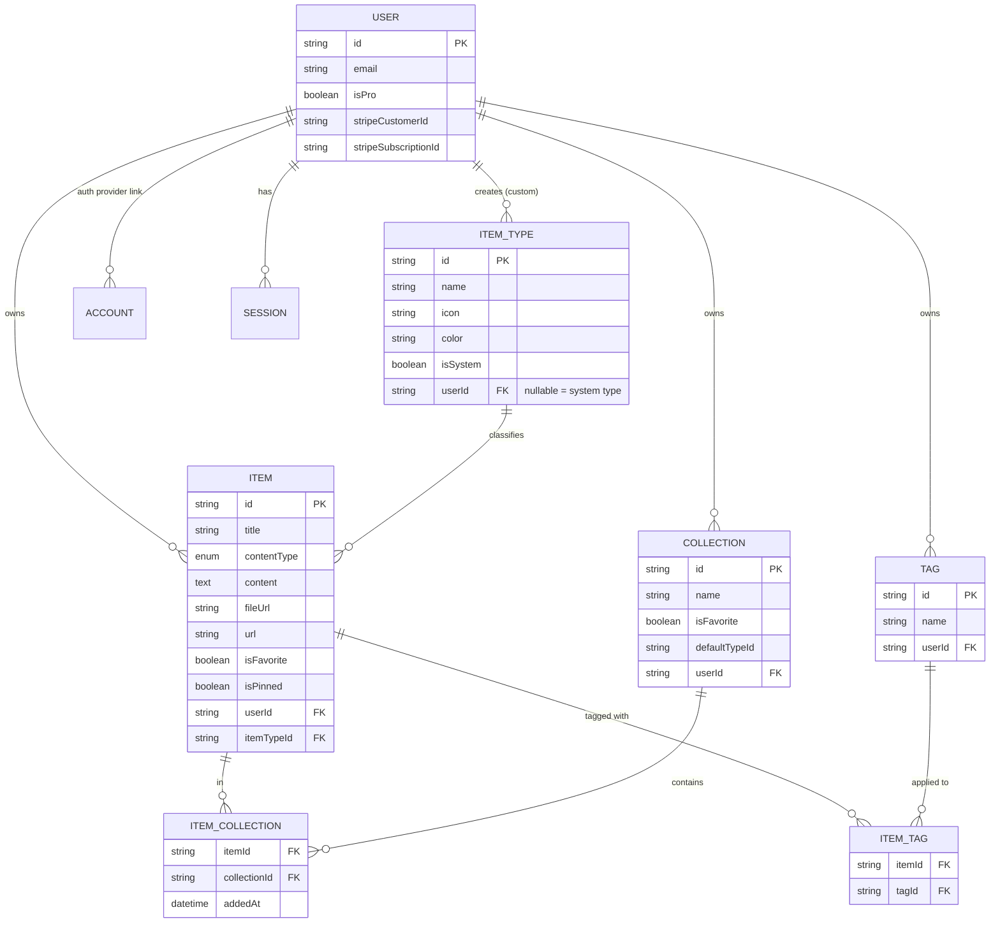
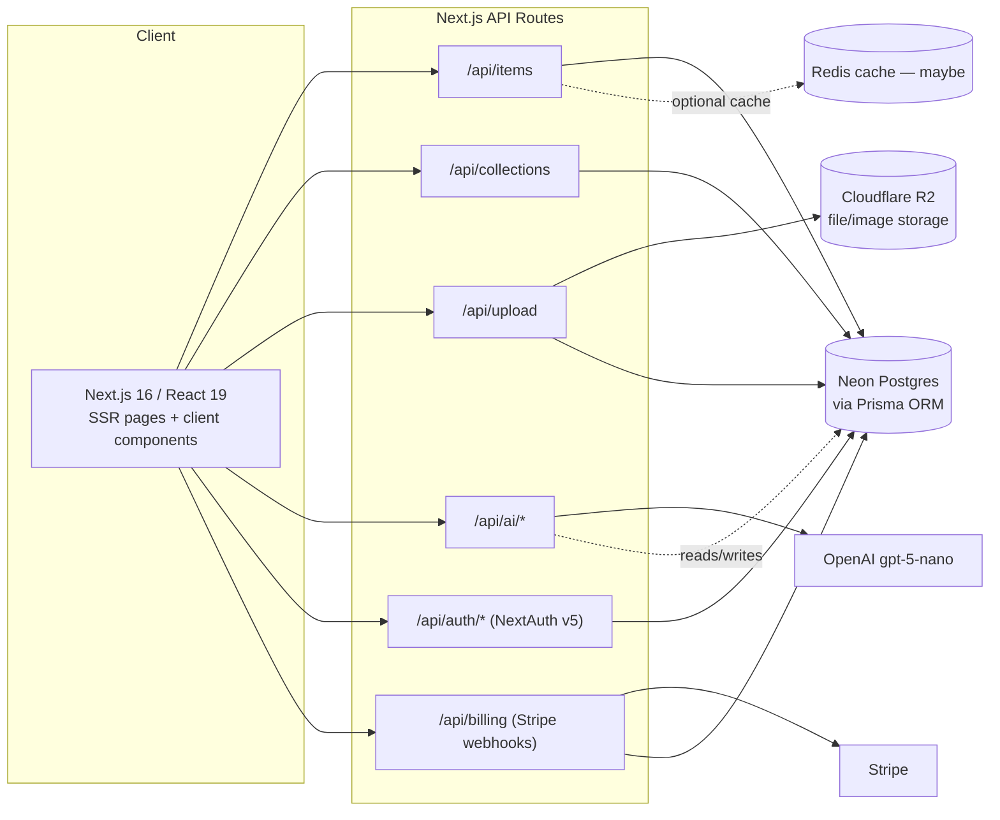
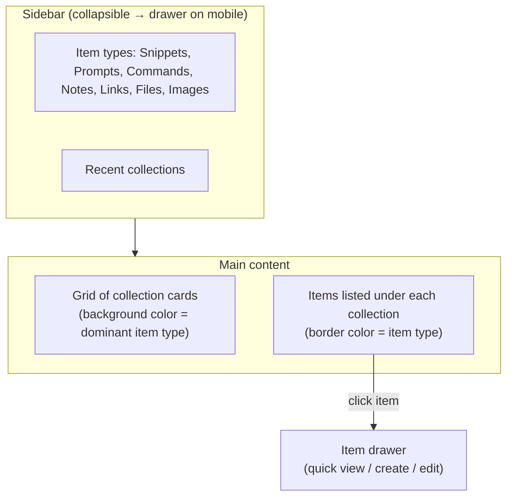

# 📦 DevStash — Project Overview

> A fast, searchable, AI-enhanced hub for everything a developer needs to stash and find again: snippets, prompts, commands, notes, links, and files.

**Status:** Planning · **Owner:** Martin · **Last updated:** 2026-09-08

---

## Table of Contents

1. [Problem](#1-problem)
2. [Target Users](#2-target-users)
3. [Features](#3-features)
4. [Data Model](#4-data-model)
5. [Architecture](#5-architecture)
6. [Tech Stack](#6-tech-stack)
7. [Monetization](#7-monetization)
8. [UI/UX](#8-uiux)
9. [Open Questions & Decisions Needed](#9-open-questions--decisions-needed)

---

## 1. Problem

Developers keep their essentials scattered across too many tools:

| Scattered today     | Should live in DevStash               |
| ------------------- | ------------------------------------- |
| Code snippets       | VS Code, Notion, gists                |
| AI prompts          | Chat history (ChatGPT, Claude, etc.)  |
| Context files       | Buried in random project folders      |
| Useful links        | Browser bookmarks                     |
| Docs                | Random folders / Google Docs          |
| Commands            | `.txt` files, notes app               |
| Project templates   | GitHub Gists                          |
| Terminal one-liners | Shell history (`history \| grep ...`) |

This fragmentation causes **context switching**, **lost knowledge**, and **inconsistent workflows**.

**DevStash's pitch:** one fast, searchable, AI-enhanced hub for all dev knowledge & resources.

---

## 2. Target Users

| Persona                           | Core need                                                    |
| --------------------------------- | ------------------------------------------------------------ |
| 🧑‍💻 **Everyday Developer**         | Fast capture/retrieval of snippets, prompts, commands, links |
| 🤖 **AI-first Developer**         | Organizes prompts, contexts, workflows, system messages      |
| 🎥 **Content Creator / Educator** | Stores code blocks, explanations, course notes               |
| 🏗️ **Full-stack Builder**         | Collects reusable patterns, boilerplates, API examples       |

---

## 3. Features

### A. Item Types

Every item has a **type**. Ships with system types (fixed, cannot be edited/deleted by users); custom types are a **later**, Pro-gated feature.

| Type      | Content kind | Notes                                       |
| --------- | ------------ | ------------------------------------------- |
| `snippet` | text         | code, with language for syntax highlighting |
| `prompt`  | text         | AI prompts / system messages                |
| `note`    | text         | markdown notes                              |
| `command` | text         | shell one-liners                            |
| `link`    | url          | bookmarked URL                              |
| `file`    | file         | 🔒 Pro only                                 |
| `image`   | file         | 🔒 Pro only                                 |

> ⚠️ **Resolved inconsistency:** the original notes modeled `contentType` as `text \| file` but also require a `url` field for links. Cleaned up below as a three-way enum: `TEXT \| URL \| FILE` (see [Data Model](#4-data-model)).

Items are designed to be **created and viewed in a drawer** (slide-over panel) for speed — no full page navigation for quick capture.

### B. Collections

- Freeform folders that can hold items of **any type** (e.g. "React Patterns" can mix snippets + notes).
- **Many-to-many**: an item can belong to multiple collections (e.g. a React snippet in both "React Patterns" and "Interview Prep").
- Example collections: _React Patterns_, _Context Files_, _Python Snippets_.

### C. Search

Unified search across:

- Content (full text)
- Tags
- Titles
- Types

### D. Authentication

- Email/password
- GitHub OAuth
- via **NextAuth v5**

### E. Other Features

- ⭐ Favorite collections & items
- 📌 Pin items to top
- 🕓 Recently used
- 📥 Import code from a file
- 📝 Markdown editor for text types
- 📎 File upload for `file` / `image` types
- 📤 Export data (multiple formats)
- 🌙 Dark mode (default) / light mode
- 🔗 Add/remove an item to/from multiple collections
- 👀 View which collections an item belongs to

### F. AI Features (Pro only)

| Feature              | Description                             |
| -------------------- | --------------------------------------- |
| Auto-tag suggestions | Suggest tags based on content           |
| Summaries            | Condense long snippets/notes            |
| Explain This Code    | Plain-language explanation of a snippet |
| Prompt optimizer     | Rewrite/improve a saved prompt          |

> Model: **OpenAI `gpt-5-nano`**

---

## 4. Data Model

The original notes had a few gaps that would break in Prisma (no `url` in `contentType`, no join table columns for tags, `ItemType`/`Collection` relations left as comments). Below is a normalized, migration-ready schema — **all relation and join tables are explicit**, so `prisma migrate dev` produces a clean SQL history.

### Entity Relationship Diagram



### Prisma Schema

```prisma
generator client {
  provider = "prisma-client-js"
}

datasource db {
  provider = "postgresql"
  url      = env("DATABASE_URL")
}

// ─────────────────────────────────────────────
// Auth (NextAuth v5 — Prisma adapter shape)
// ─────────────────────────────────────────────

model User {
  id             String    @id @default(cuid())
  name           String?
  email          String?   @unique
  emailVerified  DateTime?
  image          String?
  hashedPassword String? // set when using email/password credentials

  // Billing (Stripe)
  isPro                Boolean   @default(false)
  stripeCustomerId     String?   @unique
  stripeSubscriptionId String?   @unique
  proSince             DateTime?

  accounts    Account[]
  sessions    Session[]
  items       Item[]
  itemTypes   ItemType[]
  collections Collection[]
  tags        Tag[]

  createdAt DateTime @default(now())
  updatedAt DateTime @updatedAt
}

model Account {
  id                String  @id @default(cuid())
  userId            String
  type              String
  provider          String
  providerAccountId String
  refresh_token     String? @db.Text
  access_token      String? @db.Text
  expires_at        Int?
  token_type        String?
  scope             String?
  id_token          String? @db.Text
  session_state     String?

  user User @relation(fields: [userId], references: [id], onDelete: Cascade)

  @@unique([provider, providerAccountId])
}

model Session {
  id           String   @id @default(cuid())
  sessionToken String   @unique
  userId       String
  expires      DateTime

  user User @relation(fields: [userId], references: [id], onDelete: Cascade)
}

model VerificationToken {
  identifier String
  token      String   @unique
  expires    DateTime

  @@unique([identifier, token])
}

// ─────────────────────────────────────────────
// Core domain
// ─────────────────────────────────────────────

enum ContentType {
  TEXT // snippet, prompt, note, command
  URL  // link
  FILE // file, image
}

model ItemType {
  id       String  @id @default(cuid())
  name     String // "snippet", "prompt", "note", "command", "link", "file", "image", or custom
  icon     String // lucide-react icon name, e.g. "Code"
  color    String // hex, e.g. "#3b82f6"
  isSystem Boolean @default(false) // true = built-in, cannot be edited/deleted

  // null for system types (shared across all users)
  userId String?
  user   User?   @relation(fields: [userId], references: [id], onDelete: Cascade)

  items             Item[]
  defaultCollections Collection[] @relation("CollectionDefaultType")

  createdAt DateTime @default(now())

  @@unique([userId, name])
  @@index([userId])
}

model Item {
  id          String      @id @default(cuid())
  title       String
  contentType ContentType

  // exactly one of these three is populated, based on contentType
  content     String? @db.Text // TEXT
  url         String? // URL
  fileUrl     String? // FILE — Cloudflare R2 object URL
  fileName    String? // FILE — original filename
  fileSize    Int?    // FILE — bytes

  description String? @db.Text
  language    String? // syntax highlighting hint, for snippets

  isFavorite     Boolean   @default(false)
  isPinned       Boolean   @default(false)
  lastAccessedAt DateTime? // powers "Recently used"

  userId String
  user   User   @relation(fields: [userId], references: [id], onDelete: Cascade)

  itemTypeId String
  itemType   ItemType @relation(fields: [itemTypeId], references: [id])

  collections ItemCollection[]
  tags        ItemTag[]

  createdAt DateTime @default(now())
  updatedAt DateTime @updatedAt

  @@index([userId])
  @@index([itemTypeId])
  @@index([userId, isPinned])
  @@index([userId, isFavorite])
}

model Collection {
  id          String  @id @default(cuid())
  name        String // "React Hooks", "Prototype Prompts", "Context Files"
  description String?
  isFavorite  Boolean @default(false)

  // suggested type for new items added with no explicit type
  defaultTypeId String?
  defaultType   ItemType? @relation("CollectionDefaultType", fields: [defaultTypeId], references: [id])

  userId String
  user   User   @relation(fields: [userId], references: [id], onDelete: Cascade)

  items ItemCollection[]

  createdAt DateTime @default(now())
  updatedAt DateTime @updatedAt

  @@index([userId])
}

// Explicit join table (not implicit m:n) so we can store addedAt
model ItemCollection {
  itemId       String
  collectionId String
  addedAt      DateTime @default(now())

  item       Item       @relation(fields: [itemId], references: [id], onDelete: Cascade)
  collection Collection @relation(fields: [collectionId], references: [id], onDelete: Cascade)

  @@id([itemId, collectionId])
  @@index([collectionId])
}

model Tag {
  id     String @id @default(cuid())
  name   String
  userId String
  user   User   @relation(fields: [userId], references: [id], onDelete: Cascade)

  items ItemTag[]

  createdAt DateTime @default(now())

  @@unique([userId, name])
}

model ItemTag {
  itemId String
  tagId  String

  item Item @relation(fields: [itemId], references: [id], onDelete: Cascade)
  tag  Tag  @relation(fields: [tagId], references: [id], onDelete: Cascade)

  @@id([itemId, tagId])
  @@index([tagId])
}
```

**Migration rule (non-negotiable, per project notes):** ⚠️ Never use `prisma db push` or hand-edit the database schema. All schema changes go through `prisma migrate dev` locally, committed, then `prisma migrate deploy` in production.

---

## 5. Architecture



Single Next.js codebase/repo (monolith) — API routes handle items CRUD, file uploads, and AI calls; no separate backend service.

---

## 6. Tech Stack

| Layer | Choice | Docs |
| --- | --- | --- |
| Framework | Next.js 16 / React 19 (SSR + client components) | [nextjs.org/docs](https://nextjs.org/docs) · [react.dev](https://react.dev) |
| Language | TypeScript | [typescriptlang.org](https://www.typescriptlang.org/docs/) |
| Database | Neon (serverless Postgres) | [neon.tech/docs](https://neon.tech/docs) |
| ORM | Prisma (latest — check current major before starting) | [prisma.io/docs](https://www.prisma.io/docs) |
| Cache (maybe) | Redis | [redis.io/docs](https://redis.io/docs/latest/) |
| File storage | Cloudflare R2 | [developers.cloudflare.com/r2](https://developers.cloudflare.com/r2/) |
| Auth | NextAuth v5 (email/password + GitHub OAuth) | [authjs.dev](https://authjs.dev) |
| AI | OpenAI `gpt-5-nano` | [platform.openai.com/docs](https://platform.openai.com/docs) |
| Styling | Tailwind CSS v4 | [tailwindcss.com/docs](https://tailwindcss.com/docs) |
| Components | shadcn/ui | [ui.shadcn.com](https://ui.shadcn.com) |
| Payments | Stripe (subscriptions) | [stripe.com/docs](https://stripe.com/docs) |
| Icons | lucide-react | [lucide.dev](https://lucide.dev) |

**Rules:**

- One repo, one codebase — minimize overhead.
- Never `prisma db push` — migrations only (dev → prod).
- Versions above (Next 16, React 19, Prisma latest major, Tailwind v4) move fast — pull current docs before scaffolding, since exact release numbers can drift between when notes are written and when the project is built.

---

## 7. Monetization

Freemium. **During development, all users get full access to everything** — gating is built but not enforced until launch.

|                      | Free                      | Pro — $8/mo or $72/yr |
| -------------------- | ------------------------- | --------------------- |
| Items                | 50 total                  | Unlimited             |
| Collections          | 3                         | Unlimited             |
| System types         | All except `file`/`image` | All                   |
| File & image uploads | ❌                        | ✅                    |
| Custom types         | ❌                        | ✅ (later milestone)  |
| Search               | Basic                     | Basic                 |
| AI auto-tagging      | ❌                        | ✅                    |
| AI code explanation  | ❌                        | ✅                    |
| AI prompt optimizer  | ❌                        | ✅                    |
| Export data          | ❌                        | ✅ (JSON/ZIP)         |
| Support              | —                         | Priority              |

`User.isPro`, `stripeCustomerId`, `stripeSubscriptionId` (see [Data Model](#4-data-model)) are the foundation for gating; enforce via a shared `canAccess(feature, user)` check rather than scattering `if (isPro)` across routes.

---

## 8. UI/UX

### General

- Modern, minimal, developer-focused — references: **Notion, Linear, Raycast**
- Dark mode by default, light mode optional
- Clean typography, generous whitespace, subtle borders/shadows
- Syntax highlighting on all code blocks

### Layout



- **Sidebar:** item types with links to filtered views, plus latest/pinned collections.
- **Main:** grid of color-coded collection cards (background tinted by the most common item type inside); items shown in color-coded cards (border = type color) underneath.
- **Item drawer:** fast create/view/edit without leaving the page.

### Design References

refer to the screenshots below as a base for the dasboard UI. It dose not to have be exact use it as a refrenece. @context/screenshots/dashboard-ui-main.png @context/screenshots/dashboard-ui-drawer.png

### Type Colors & Icons

| Type    | Color      | Hex       | Icon (lucide) |
| ------- | ---------- | --------- | ------------- |
| Snippet | 🔵 Blue    | `#3b82f6` | `Code`        |
| Prompt  | 🟣 Purple  | `#8b5cf6` | `Sparkles`    |
| Command | 🟠 Orange  | `#f97316` | `Terminal`    |
| Note    | 🟡 Yellow  | `#fde047` | `StickyNote`  |
| File    | ⚪ Gray    | `#6b7280` | `File`        |
| Image   | 🌸 Pink    | `#ec4899` | `Image`       |
| Link    | 🟢 Emerald | `#10b981` | `Link`        |

### Responsive

- Desktop-first, mobile-usable.
- Sidebar collapses into a drawer on mobile.

### Micro-interactions

- Smooth transitions, hover states on cards
- Toast notifications for actions
- Loading skeletons

---

## 9. Open Questions & Decisions Needed

These are gaps or contradictions in the original notes worth resolving before/while building:

1. **`contentType` enum** — original notes only listed `text | file`, but `link` needs a URL. Resolved above as `TEXT | URL | FILE`; confirm this matches intended validation logic (e.g. a `link` item should require `url`, forbid `content`/`fileUrl`).
2. **Export formats** — "Export data as different formats" (features) vs. "Export data (JSON/ZIP)" (Pro tier) — confirm JSON/ZIP is the full scope, or if Markdown/CSV export is also wanted.
3. **Custom item types** — listed as a feature in section A but marked "(Will come later)" under Pro monetization. Confirm it's out of scope for v1 launch.
4. **Redis** — marked "Maybe." Decide whether caching is in v1 or purely a later optimization; affects whether infra is provisioned now.
5. **`defaultTypeId` on Collection** — behavior when a collection has items of multiple types isn't specified (e.g. does the "dominant color" on the card recalculate live, or only use `defaultTypeId`?).
6. **Tags** — no color/icon, unlike types. Confirm tags stay plain labels (as modeled) rather than becoming a second taxonomy with visuals.
7. **Free tier limits enforcement point** — during dev, all access is open; need a decision on the exact date/trigger for turning on enforcement (e.g. at public launch vs. a soft-launch date).
